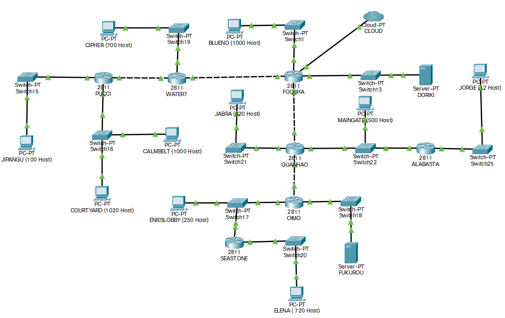

# Jarkom-Modul-4-D09-2021

Nama Anggota | NRP
------------------- | --------------		
Dias Tri Kurniasari | 05111940000035
Nazhwa Ameera H | 05111940000133
Nur Moh. Ihsanuddien | 05111940000142

## Subnetting dan Routing 



Topologi di atas dilakukan perhitungan pembagian subnet dengan menggunakan metode `Classless` yaitu :
1. `VLSM` (Variable Length Subnet Masking) di GNS
2. `CIDR` (Clasless Inter Domain Routing) di Cisco Packet Tracer)


## Awalan
Melakukan pembagian subnet terhadap topologi yang ada


Dari hasil pembagiansubnet, didapatkan sejumlah <b>13 subnet<b> dan <b>2 subnet untuk server<b>.


## Perhitungan VLSM
1. Menentukan jumlah alamat IP yang dibutuhkan oleh tiap subnet dari 15 subnet yang ada termasuk 2 subnet untuk server.

    Subnet | Jumlah IP | Netmask
    -------| --------- | -------	
    A1 | 1001 | /22
    A2 | 701 | /22
    A3 | 2 | /30
    A4 | 2 | /30
    A5 | 101 | /25
    A6 | 2021 | /21
    A7 | 521 | /22
    A8 | 502 | /23
    A9 | 13 | /28
    A10 | 2 | /30
    A11 | 2 | /30
    A12 | 252 | /24
    A13 | 721 | /22
    A14 | 2 | /30
    A15 | 2 | /30
    Total | 5845 | /19

    Sehingga, kita dapat menggunakan netmask /19 untuk memberikan pangalamatan IP pada 15 subnet.

2. Subnet besar yang kami bentuk memiliki `NID 192.196.0.0` dengan netmask /19. Kemudian, melakukan perhitungan pembagian IP dengan bantuan pohon IP


Sehingga, pembagian IP yang memungkinkan untuk topologi yang ada adalah sebagai berikut:

Subnet | NID | Netmask
-------| --- | -------
A1 | 192.196.8.0 | /22
A2 | 192.196.12.0 | /22
A3 | 192.196.27.144 | /30
A4 | 192.196.27.148 | /30
A5 | 192.196.27.0 | /25
A6 | 192.196.0.0 | /21
A7 | 192.196.16.0 | /22
A8 | 192.196.24.0 | /23
A9 | 192.196.27.128 | /28
A10 | 192.196.27.152 | /30
A11 | 192.196.27.156 | /30
A12 | 192.196.26.0 | /24
A13 | 192.196.20.0 | /22
A14 | 192.196.27.160 | /30
A15 | 192.196.27.164 | /30


## Perhitungan CIDR
1. Dari proses penggabungan yang telah dilakukan, didapatkan sebuah subnet besar dengan netmask `/16`. Menggunakan NID `192.196.0.0`, netmask `/16`.


<br>

<br>

<br>

<br>

<br>

<br>


2. Menghitung pembagian IP dengan pohon berdasarkan penggabungan subnet yang telah dilakukan


Sehingga, pembagian IP yang memungkinkan untuk topologi yang ada adalah sebagai berikut:

Subnet | NID | Netmask
-------| --- | -------
A1 | 192.196.64.0 | /22
A2 | 192.196.160.0 | /22
A3 | 192.196.192.0 | /30
A4 | 192.196.144.0 | /30
A5 | 192.196.136.0 | /25
A6 | 192.196.128.0 | /21
A7 | 192.196.20.0 | /22
A8 | 192.196.16.0 | /23
A9 | 192.196.18.0 | /28
A10 | 192.196.32.0 | /30
A11 | 192.196.8.0 | /30
A12 | 192.196.4.0 | /24
A13 | 192.196.0.0 | /22

## Penggunaan CIDR pada CPT

### Subnetting dan Pembagian IP
    
 Contoh Pengaturan pada Subnet A13 :
    Pada Subnet A13 Memiliki hasil subnetting `192.196.0.0/22` sehingga IP dimulai dari `192.196.0.1`, terdapat device `Router Seastone` dan `Client Elena`
    
 1. Pada `Router Seastone` dilakukan konfigurasi :
  
    
 2. Pada `Client Elena` dilakukan konfigurasi :


Kemudian Dilakukan pembagian IP pada Subnet yang lain dihasilkan :
```
-----------------------------------
Subnet A1 :
    
FOOSHA
IP      : 192.196.64.1
Netmask : 255.255.252.0

BLUENO 
IP      : 192.196.64.2
Netmask : 255.255.252.0
Default Gateway : 192.196.64.1
-----------------------------------
Subnet A2 :
    
WATER 7
IP      : 192.196.160.1
Netmask : 255.255.252.0

CIPHER 
IP      : 192.196.160.2
Netmask : 255.255.252.0
Default Gateway : 192.196.160.1
-----------------------------------
Subnet A3 :
    
FOOSHA
IP      : 192.196.192.1
Netmask : 255.255.255.252

WATER 7
IP      : 192.196.192.2
Netmask : 255.255.255.252
-----------------------------------
Subnet A4 :
    
WATER 7
IP      : 192.196.144.1
Netmask : 255.255.255.252

PUCCI
IP      : 192.196.144.2
Netmask : 255.255.255.252
-----------------------------------
Subnet A5 :

PUCCI
IP      : 192.196.136.1
Netmask : 255.255.255.128

JIPANGU
IP      : 192.196.136.2
Netmask : 255.255.255.128
Default Gateway :  192.196.136.1
-----------------------------------
Subnet A6 :

PUCCI
IP      : 192.196.128.1
Netmask : 255.255.248.0

CALMBELT
IP      : 192.196.128.2
Netmask : 255.255.248.0
Default Gateway : 192.196.128.1
    
COURTYARD
IP      : 192.196.128.3
Netmask : 255.255.248.0
Default Gateway : 192.196.128.1
-----------------------------------
Subnet A7 :

GUANHAO
IP      : 192.196.20.1
Netmask : 255.255.252.0

JABRA
IP      : 192.196.20.2
Netmask : 255.255.252.0
Default Gateway : 192.196.20.1
-----------------------------------
Subnet A8 :
    
GUANHAO 
IP      : 192.196.16.1
Netmask : 255.255.254.0

MAINGATE
IP      : 192.196.16.2
Netmask : 255.255.254.0
Default Gateway : 192.196.16.1
    
ALABASTA
IP      : 192.196.16.3
Netmask : 255.255.254.0
-----------------------------------
Subnet A9 :
   
ALABASTA
IP      : 192.196.18.1
Netmask : 255.255.255.240

JORGE
IP      : 192.196.18.2
Netmask : 255.255.255.240
Default Gateway : 192.196.18.1

-----------------------------------
Subnet A10 :

FOOSHA
IP      : 192.196.32.1
Netmask : 255.255.255.252

GUANHAO
IP      : 192.196.32.2
Netmask : 255.255.255.252
-----------------------------------
Subnet A11 :

GUANHAO
IP      : 192.196.8.1
Netmask : 255.255.255.252

OIMO
IP      : 192.196.8.2
Netmask : 255.255.255.252
-----------------------------------
Subnet A12 :
OIMO 
IP      : 192.196.4.1
Netmask : 255.255.255.0

SEASTONE
IP      : 192.196.4.2
Netmask : 255.255.255.0
    
ENIESLOBBY
IP      : 192.196.4.3
Netmask : 255.255.255.0
Default Gateway : 192.196.4.1
-----------------------------------
Subnet A13 :
SEASTONE
IP      : 192.196.0.1
Netmask : 255.255.252.0

ELENA
IP      : 192.196.0.2
Netmask : 255.255.252.0
Default Gateway : 192.196.0.1
-----------------------------------

```

### Routing
    Pengaturan Routing dilakukan dengan melakukan konfigurasi pada `config->routing->static` :
* FOOSHA
    ```
    192.196.136.0/25 via 192.196.192.2
    192.196.160.0/22 via 192.196.192.2
    192.196.144.0/30 via 192.196.192.2
    192.196.128.0/21 via 192.196.192.2
    192.196.20.0/22 via 192.196.32.2
    192.196.16.0/23 via 192.196.32.2
    192.196.18.0/28 via 192.196.32.2
    192.196.8.0/30 via 192.196.32.2
    192.196.4.0/24 via 192.196.32.2
    192.196.0.0/22 via 192.196.32.2
    ```
* WATER 7
    ```
    0.0.0.0/0 via 192.196.192.1
    192.196.136.0/25 via 192.196.144.2
    192.196.128.0/21 via 192.196.144.2
    
    ```
* PUCCI
    ```
    0.0.0.0/0 via 192.196.144.1
    ```
* GUANHAO
    ```
    0.0.0.0/0 via 192.196.32.1
    192.196.4.0/24 via 192.196.8.2
    192.196.0.0/22 via 192.196.8.2
    192.196.18.0/28 via 192.196.16.3
    ```
* ALABASTA
    ```
    0.0.0.0/0 via 192.196.16.1
    ```
* OIMO
    ```
    0.0.0.0/0 via 192.196.8.1
    192.196.0.0/22 via 192.196.4.2
    ```
* SEASTONE
    ```
    0.0.0.0/0 via 192.196.4.1
    ```
### Testing
    
 

    
## Penggunaan VLSM pada GNS3
Pada GNS3, hasil perhitungan IP menggunakan metode VSLM dimasukkan ke dalam setting konfigurasi interface di setiap nodenya. Berikut merupakan konfigurasi yang dimasukkan.  
####  
Foosha   
```
auto eth0
iface eth0 inet dhcp

auto eth1 #A1
iface eth1 inet static
address 192.196.8.1
netmask 255.255.252.0

auto eth2 #A3
iface eth2 inet static
address 192.196.27.145
netmask 255.255.255.252

auto eth3 #A10
iface eth3 inet static
address 192.196.27.153
netmask 255.255.255.252

auto eth4 #A14
iface eth4 inet static
address 192.196.27.161
netmask 255.255.255.252
```
#### Water7   
```
auto eth0 #A3
iface eth0 inet static
address 192.196.27.146
netmask 255.255.255.252
gateway 192.196.27.145

auto eth1 #A2
iface eth1 inet static
address 192.196.12.1
netmask 255.255.252.0

auto eth2 #A4
iface eth2 inet static
address 192.196.27.149
netmask 255.255.255.252
```
#### Pucci  
```
auto eth0 #A4
iface eth0 inet static
address 192.196.27.150
netmask 255.255.255.252
gateway 192.196.27.149

auto eth1 #A5
iface eth1 inet static
address 192.196.27.1
netmask 255.255.255.128

auto eth2 #A6
iface eth2 inet static
address 192.196.0.1
netmask 255.255.248.0 
```
#### Guanhao
```
auto eth0 #A10
iface eth0 inet static
address 192.196.27.154
netmask 255.255.255.252
gateway 192.196.27.153

auto eth1 #A7
iface eth1 inet static
address 192.196.16.1
netmask 255.255.252.0

auto eth2 #A11
iface eth2 inet static
address 192.196.27.157
netmask 255.255.255.252

auto eth3 #A8
iface eth3 inet static
address 192.196.24.1
netmask 255.255.254.0  
```
#### ALABASTA
``` 
auto eth0 #A8
iface eth0 inet static
address 192.196.24.2
netmask 255.255.254.0
gateway 192.196.24.1

auto eth1 #A9
iface eth1 inet static
address 192.196.27.129
netmask 255.255.255.240
```
#### Oimo  
``` 
auto eth0 #A11
iface eth0 inet static
address 192.196.27.158
netmask 255.255.255.252
gateway 192.196.27.157

auto eth1 #A12
iface eth1 inet static
address 192.196.26.1
netmask 255.255.255.0

auto eth2 #A15
iface eth2 inet static
address 192.196.27.165
netmask 255.255.255.252
```
#### Seastone
```
auto eth0 #A12
iface eth0 inet static
address 192.196.26.2
netmask 255.255.255.0
gateway 192.196.26.1

auto eth1 #A13
iface eth1 inet static
address 192.196.20.1
netmask 255.255.252.0
```
#### Jipangu  
```
auto eth0 #A5
iface eth0 inet static
address 192.196.27.2
netmask 255.255.255.128
gateway 192.196.27.1
```
#### Cipher  
```
auto eth0 #A2
iface eth0 inet static
address 192.196.12.2
netmask 255.255.252.0
gateway 192.196.12.1
```
#### Courtyard   
```
auto eth0 #A6
iface eth0 inet static
address 192.196.0.3
netmask 255.255.248.0
gateway 192.196.0.1
```
#### Calmbelt  
``` 
auto eth0 #A6
iface eth0 inet static
address 192.196.0.2
netmask 255.255.248.0
gateway 192.196.0.1
```
#### Blueno  
```
auto eth0 #A1
iface eth0 inet static
address 192.196.8.2
netmask 255.255.252.0
gateway 192.196.8.1
```
#### Jabra  
```
auto eth0 #A7
iface eth0 inet static
address 192.196.16.2
netmask 255.255.252.0
gateway 192.196.16.1
```
#### EniesLobby  
```
auto eth0 #A12
iface eth0 inet static
address 192.196.26.3
netmask 255.255.255.0
gateway 192.196.26.1
```
#### Elena
```
auto eth0 #A13
iface eth0 inet static
address 192.196.20.2
netmask 255.255.252.0
gateway 192.196.20.1
```
#### Maingate
```
auto eth0 #A8
iface eth0 inet static
address 192.196.24.3
netmask 255.255.254.0
gateway 192.196.24.1
```
#### Jorge  
```
auto eth0 #A9
iface eth0 inet static
address 192.196.27.130
netmask 255.255.255.240
gateway 192.196.27.129
```
#### Doriki
```
auto eth0 #A14
iface eth0 inet static
address 192.196.27.162
netmask 255.255.255.252
gateway 192.196.27.161
```
#### Fukurou
```
auto eth0 #A15
iface eth0 inet static
address 192.196.27.166
netmask 255.255.255.252
gateway 192.196.27.165
```   
  
Setelah konfigurasi selesai dilakukan rerstart node dan jalankan perintah `echo "iptables -t nat -A POSTROUTING -o eth0 -j MASQUERADE -s 192.196.0.0/16" >> /root/.bashrc` pada Foosha agar ia dapat terhubung dengan internet.  
  
Jalankan perintah `echo 'echo "nameserver 192.168.122.1" > /etc/resolv.conf' >> /root/.bashrc` pada node-node lain agar node-node tersebut dapat terhubung ke internet juga. Untuk saat ini, lakukan testing sederhana dengan perintah `ping google.com` di 4 node yang terhubung langsung dengan Foosha untuk memastikan Foosha sudah terhubung dengan internet.  
  

  
Lakukan routing pada router Foosha, Water7, Guanhou, dan Oimi. Buat sebuah file bernama route.sh dengan perintah `nano route.sh` pada keempat router dan tulis script berikut di masing-masing router.  
```
FOOSHA
route add -net 192.196.12.0 netmask 255.255.252.0 gw 192.196.27.146 #A2
route add -net 192.196.27.148 netmask 255.255.255.252 gw 192.196.27.146 #A4
route add -net 192.196.27.0 netmask 255.255.255.128 gw 192.196.27.146 #A5
route add -net 192.196.0.0 netmask 255.255.248.0 gw 192.196.27.146 #A6

route add -net 192.196.16.0 netmask 255.255.252.0 gw 192.196.27.154 #A7
route add -net 192.196.24.0 netmask 255.255.254.0 gw 192.196.27.154 #A8
route add -net 192.196.27.128 netmask 255.255.255.240 gw 192.196.27.154 #A9
route add -net 192.196.27.156 netmask 255.255.255.252 gw 192.196.27.154 #A11
route add -net 192.196.26.0 netmask 255.255.255.0 gw 192.196.27.154 #A12
route add -net 192.196.20.0 netmask 255.255.252.0 gw 192.196.27.154 #A13
route add -net 192.196.27.164 netmask 255.255.255.252 gw 192.196.27.154 #A15


WATER7
route add -net 192.196.27.0 netmask 255.255.255.128 gw 192.196.27.150 #A5
route add -net 192.196.0.0 netmask 255.255.248.0 gw 192.196.27.150 #A6
route add -net 192.196.27.144 netmask 255.255.255.252 gw 192.196.27.146 #A3

GUANHAO
route add -net 192.196.27.128 netmask 255.255.255.240 gw 192.196.24.2 #A9
route add -net 192.196.27.152 netmask 255.255.255.252 gw 192.196.27.154 #A10
route add -net 192.196.26.0 netmask 255.255.255.0 gw 192.196.27.158 #A12
route add -net 192.196.20.0 netmask 255.255.252.0 gw 192.196.27.158 #A13
route add -net 192.196.27.164 netmask 255.255.255.252 gw 192.196.27.158 #A15

OIMO
route add -net 192.196.27.156 netmask 255.255.255.252 gw 192.196.27.158#A11
route add -net 192.196.20.0 netmask 255.255.252.0 gw 192.196.26.2 #A13
```  
Apabila proses routing selesai dilakukan, restart ulang semua node dan jalankan script yang sudah dibuat.
### Testing  
Melakukan testing dengan perintah `ping its.ac.id`  
 
   
Melakukan testing dengan melakukan ping antarclient  


Melakukan testing dengan melakuakn ping antarserver  

    
## Error dan Kendala   
1. Kesalahan dalam penulisan IP dan/atau atribut-atribut lain dalam konfigurasi.
