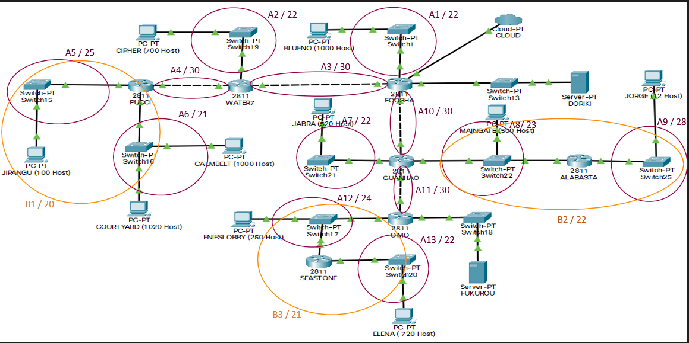

# Jarkom-Modul-4-D09-2021

Nama Anggota | NRP
------------------- | --------------		
Dias Tri Kurniasari | 05111940000035
Nazhwa Ameera H | 05111940000133
Nur Moh. Ihsanuddien | 05111940000142

## Subnetting dan Routing 

Topologi di atas dilakukan perhitungan pembagian subnet dengan menggunakan metode `Classless` yaitu :
1. `VLSM` (Variable Length Subnet Masking) di GNS
2. `CIDR` (Clasless Inter Domain Routing) di Cisco Packet Tracer)

## Awalan
Melakukan pembagian subnet terhadap topologi yang ada

Dari hasil pembagiansubnet, didapatkan sejumlah <b>13 subnet<b> dan <b>2 subnet untuk server<b>.

## Perhitungan VLSM
1. Menentukan jumlah alamat IP yang dibutuhkan oleh tiap subnet dari 15 subnet yang ada termasuk 2 subnet untuk server.

    Subnet | Jumlah IP | Netmask
    -------| --------- | -------	
    A1 | 1001 | /22
    A2 | 701 | /22
    A3 | 2 | /30
    A4 | 2 | /30
    A5 | 101 | /25
    A6 | 2021 | /21
    A7 | 521 | /22
    A8 | 502 | /23
    A9 | 13 | /28
    A10 | 2 | /30
    A11 | 2 | /30
    A12 | 252 | /24
    A13 | 721 | /22
    A14 | 2 | /30
    A15 | 2 | /30
    Total | 5845 | /19

    Sehingga, kita dapat menggunakan netmask /19 untuk memberikan pangalamatan IP pada 15 subnet.

2. Subnet besar yang kami bentuk memiliki `NID 192.196.0.0` dengan netmask /19. Kemudian, melakukan perhitungan pembagian IP dengan bantuan pohon IP

Sehingga, pembagian IP yang memungkinkan untuk topologi yang ada adalah sebagai berikut:

Subnet | NID | Netmask
-------| --- | -------
A1 | 192.196.8.0 | /22
A2 | 192.196.12.0 | /22
A3 | 192.196.27.144 | /30
A4 | 192.196.27.148 | /30
A5 | 192.196.27.0 | /25
A6 | 192.196.0.0 | /21
A7 | 192.196.16.0 | /22
A8 | 192.196.24.0 | /23
A9 | 192.196.27.128 | /28
A10 | 192.196.27.152 | /30
A11 | 192.196.27.156 | /30
A12 | 192.196.26.0 | /24
A13 | 192.196.20.0 | /22
A14 | 192.196.27.160 | /30
A15 | 192.196.27.164 | /30

## Perhitungan CIDR
1. Dari proses penggabungan yang telah dilakukan, didapatkan sebuah subnet besar dengan netmask `/16`. Menggunakan NID `192.196.0.0`, netmask `/16`.

 

 

 

 

 

 

2. Menghitung pembagian IP dengan pohon berdasarkan penggabungan subnet yang telah dilakukan

Sehingga, pembagian IP yang memungkinkan untuk topologi yang ada adalah sebagai berikut:

Subnet | NID | Netmask
-------| --- | -------
A1 | 192.196.64.0 | /22
A2 | 192.196.160.0 | /22
A3 | 192.196.192.0 | /30
A4 | 192.196.144.0 | /30
A5 | 192.196.136.0 | /25
A6 | 192.196.128.0 | /21
A7 | 192.196.20.0 | /22
A8 | 192.196.16.0 | /23
A9 | 192.196.18.0 | /28
A10 | 192.196.32.0 | /30
A11 | 192.196.8.0 | /30
A12 | 192.196.4.0 | /24
A13 | 192.196.0.0 | /22

## Penggunaan CIDR pada CPT

### Subnetting dan Pembagian IP
    
 Contoh Pengaturan pada Subnet A13 :
    Pada Subnet A13 Memiliki hasil subnetting `192.196.0.0/22` sehingga IP dimulai dari `192.196.0.1`, terdapat device **Router Seastone** dan **Client Elena**
    
 1. Pada **Router Seastone** dilakukan konfigurasi :
  
    
 2. Pada **Client Elena** dilakukan konfigurasi :

### Routing
    
## Penggunaan VLSM pada GNS3

### 
    
## Error dan Kendala
